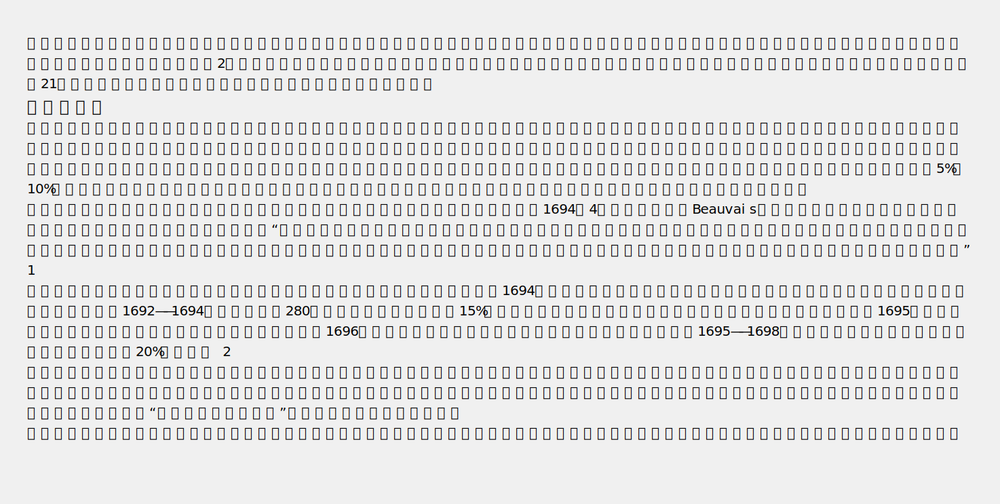

**The project is developing**

### Reasons for Using SVG in a Reader

1.SVG is a vector graphics format that can maintain high-quality text rendering at any resolution without distortion when zoomed in.

2.Cross-platform compatibility: SVG is supported by most browsers and devices. The SVG version of the eBook uses concatenated SVG strings at its core, ensuring that as long as the environment supports SVG rendering, the eBook's functionality will work properly.

### Supposing usage

Because it involves file operations, such as read `.epub` file and parse xml. So this pkg now cannot run in browser, it could run in the platform that support node.

```typescript
// from packages/reader/src/reader.ts
import { Reader } from 'svg-ebook-reader'
const reader = Reader('./example/alice.epub')
const {
  toPrevPage,
  toNextPage,
  getPageIndex,
  getChapterIndex,
  getCurrChapterPageCount,
} = reader

;(async () => {
  // get the first page of this book,
  //  and it could init specific page of other chapter when pass some pamameters, but this feature has not been implemented
  const currentPage = await reader.init()

  // get previous page svg string, it will return undefined if the current page is the first page in the first chapter
  // when entering the next chapter, it will automatically load the next chapter after the next in Promise, toNextPage() is the same
  const prevPage = toPrevPage()

  // get next page svg string, it will return undefined if the current page is the last page in the last chapter
  const nextPage = toNextPage()
})()
```

### The current render result

Now, it could only render one colume and with no first line indention. This project will also support two/three line rendering in the future, Although you could adjust width/height and x/y to support this.



